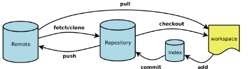

*via:liying*
# Git
## Git是什么
### Git是目前世界上最先进的分布式版本控制系统

### 
## 设置
### 配置用户名
* git config --global user.name  "你自己Github的用户名"
### 配置邮箱
* git config --global user.email "你自己Github的注册邮箱"
## 版本库
### 什么是版本库？
* 又名仓库，可以理解成一个目录，这个目录里的所有文件都可以被Git管理起来，每个文件的修改、删除，Git都能跟踪，以便任何时刻都有一个追踪历史，或者在将来某个时刻可以还原。
### 创建版本库
* 在合适的地方创建空目录
* cd进入该目录
* 使用git init 命令把这个目录变成Git可以管理的仓库
* 注意：千万不要修改.git目录里的文件
### 把文件添加到版本库
* 在仓库目录中创建一个文件（test.txt）
    * 添加This is a test.
* 把文件添加到仓库
    * git add test.txt
* 把文件提交到仓库
    * git commit -m "注释信息"
## 时光穿梭机
### git status
* 该命令可以让我们时刻掌握仓库的当前状态
* 修改test.txt文件为This is a good test.
* 执行git status
    * 子主题 1
### git diff
* 该命令可以查看修改内容
* 执行git diff
    * 子主题 1
* 将This is a good test.内容提交
### git log
* 该命令可以显示从最近到最远的提交日志
* 修改test.txt文件内容为This is a small test.
* 执行
    * git log
    * git log --pretty=oneline
### 版本回退
* 回退到上一版本
    * git reset --hard HEAD^
* 回退到上上版本
    * git reset --hard HEAD^^
* 回退到上100版本
    * git reset --hard HEAD~100
* 回退到具体版本
    * git reset --hard 具体版本号
### git reflog
* 该命令记录每一次命令
### 工作区和版本区
* 工作区
    * 仓库所在目录
* 版本库
    * .git目录是Git的版本库
        * 暂存区
        * 自动创建的一个分支（master）
        * 指向master的指针（HEAD）
* add
* commit
* git checkout -- fileName
    * 如果fileName文件自修改后还没有被放到暂存区，现在，撤销修改就会回到和版本库一模一样的状态。
    * 如果fileName文件已经添加到暂存区，又做了修改，现在，撤销修改就会回到添加到暂存区后的状态。
    * 总之，就是让这个fileName文建会到最后一次git commit或者git add时的状态
## 远程仓库
### 创建SSH Key
* 黑屏终端输入ssh-keygen -t rsa -C "Github的邮箱地址"
* 记录.shh目录位置
* 输入Github注册密码
* .ssh
    * id_rsa   私钥
    * id_rsa.pub   公钥
### 添加公有秘钥
* 登陆github官网
* settings-->SSH and GPG Keys-->New SSH key-->粘贴id_rsa.pub
* 测试秘钥是否通过
    * ssh -T git@github.com
### 创建远程仓库
* Github首页-->New repository-->Repository name-->public-->Initialize  ... readme-->Create  repository
### 关联远程仓库
* git remote add origin 远程仓库地址
### 删除关联
*  git remote rm origin 
### 推送本地库内容到远程库
* git push origin master
* 注意：需要先把远程库内容拉到本地，否则会报错
* 忽略特殊文件    .gitignore
### 拉取远程库内容到本地库
* git pull origin master
### 从零开发
* 先有远程库
* 从远程库克隆
    * git clone 远程库地址
## 分支管理
### 作用
* 子主题 1假设你准备开发一个新功能，但是需要两周才能完成，第一周你写了50%的代码，如果立刻提交，由于代码还没写完，不完整的代码库会导致别人不能干活了。如果等代码全部写完再一次提交，又存在丢失每天进度的巨大风险。
* 现在有了分支，就不用怕了。你创建了一个属于你自己的分支，别人看不到，还继续在原来的分支上正常工作，而你在自己的分支上干活，想提交就提交，直到开发完毕后，再一次性合并到原来的分支上，这样，既安全，又不影响别人工作。
### 特点
* 但Git的分支是与众不同的，无论创建、切换和删除分支，Git在1秒钟之内就能完成！无论你的版本库是1个文件还是1万个文件。
### master主分支
* 在版本回退里，每次提交，Git都把它们串成一条时间线，在Git里，这个分支叫主分支，即master分支。HEAD严格来说不是指向提交，而是指向master，master才是指向提交的，所以，HEAD指向的就是当前分支。

* 
* 每次提交，master分支都会向前移动一步，这样，随着你不断提交，master分支的线也越来越长
### 创建与合并分支
* 创建分支
    * git branch 分支名
* 切换分支
    * git checkout 分支名
* 创建与切换同时进行
    * git checkout -b 分支名

* 
* 查看当前分支
    * git branch
        * 会列出所有分支
        * 当前分支前面会有一个*号
* 在dev分支上修改文件，并提交
 
* 切换到master分支
    * git checkout master
    * 添加的内容不存在
    * 因为是在dev分支上提交的
* 把dev分支的工作结果合并到master分支上
    * git merge dev

* 删除分支
    * git branch -d 分支名
* 删除远程分支
    * git push origin：分支名
    * git push origin --delete 分支名
    * 

### 解决冲突
* 手动解决
* 
* git log --graph
    * 查看分支合并图
### 分支策略
* master分支应该是非常稳定的，也就是仅用来发布新版本，平时不能在上面干活
* 干活都在dev分支上，dev分支是不稳定的，新版本版本发布时，再把dev分支合并到master上，在master分支发布新版本
* 每个人都在dev分支上干活，每个人都有自己的分支，时不时地往dev分支上合并就可以了

### 多人协作
* 推送分支
    * git push origin master
    * git push origin dev
* 抓取分支
    * 从远程库clone时，默认只能看到master
    * 想在dev分支上开发，就必须创建origin的dev分支到本地
    * git checkut -b dev origin/dev
* 工作模式
    * 试图可以用git push origin <branch-name>推送自己的修改
    * 如果推送失败，则因为远程分支比你的本地更新，先需要用git pull试图合并
    * 如果合并有冲突，则解决冲突，并在本地提交
    * 没有冲突或者解决掉冲突后，再用git push origin <branch-name>推送就能成功
    * 如果git pull提示no tracking information，则说明本地分支和远程分支的链接关系没有创建，用命令git branch --set-upstream-to <branch-name> origin/<branch-name>。
## 标签管理
### 意义
* 开发完成，发布一个版本时，我们通常先在版本库中打一个标签（tag），这样，就唯一确定了打标签时刻的版本。将来无论什么时候，取某个标签的版本，就是把那个打标签的时刻的历史版本取出来。所以，标签也是版本库的一个快照。
### git tag 标签名
* 打标签
### git tag
* 查看所有标签
### git tag 标签名 commitID
* 指定commit id打标签
### git tag -a 标签名 -m "标签信息"
* 指定标签信息
### git checkout 标签名
* 切换到指定标签
### git show 标签名
* 查看说明文字
### git tag -d 标签名
* 删除标签
### git push origin 标签名
* 推送标签到远程
### git push origin --tags
* 一次性推送全部尚未推送到远程的本地标签
### 删除已经推送到远程的标签
* 先从本地删除
    * git tag -d 标签名
* 再从远程删除
    * git push origin ：refs/tags/标签名

